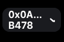

# ログイン方法

ページ上部のヘッダーに「ウォレットを接続」と書かれたボタンがあります。

こちらをクリックしてください。

<figure><figcaption></figcaption></figure>

ウォレットを選択する画面が表示されます。

MetaMask、Rainbow、Coinbase Wallet、WalletConnectからお使いのウォレットを選んでください。

以下、MetaMaskを例に説明します。

<figure><figcaption></figcaption></figure>

接続したいアカウントを選択して、「次へ」のボタンを押してください。

<figure><figcaption></figcaption></figure>

次の画面で「確認」のボタンを押してください。

<figure><figcaption></figcaption></figure>

「ウォレットを接続」のボタンが以下のようにアドレスの表示に変われば、接続完了です

<figure><figcaption></figcaption></figure>

接続を切断する場合は、上記のアドレスの表示をクリックしてください。

下の画面で「切断する」ボタンをクリックすると、切断が完了します！

<figure><figcaption></figcaption></figure>
